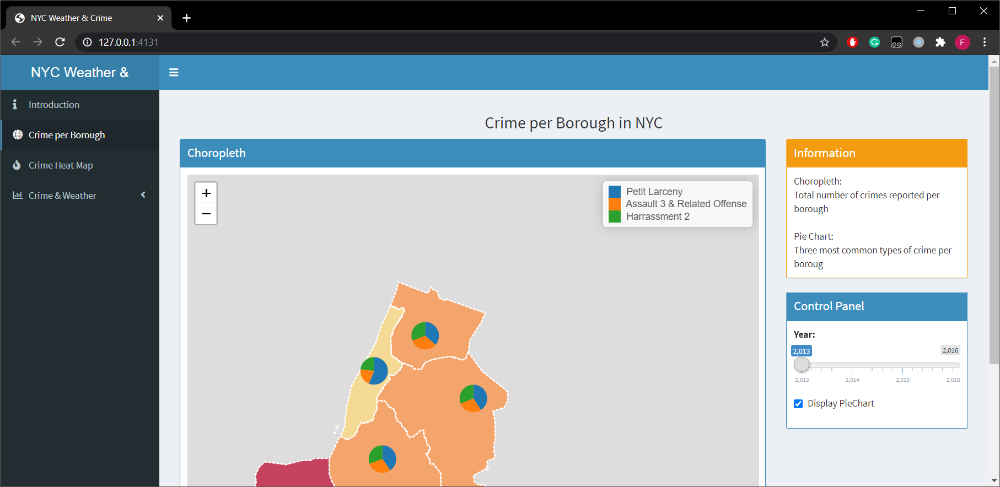
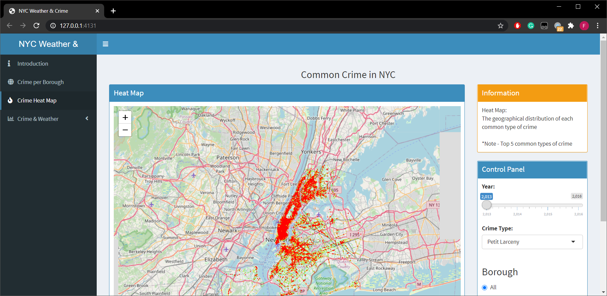

# DataViz-NYC

This project required 3 parts:

1. two R files (vizShiny.R and readdata.R)

2. two datasets which in CSV files (weather.csv and crime.csv)

   crime.csv is too large and you need to dowload from:
   
   opt1: Google Drive: https://drive.google.com/file/d/1zx4Wz0pGNbm-wCf58oVzSg_NypPL_23G/view?usp=sharing
      
   opt2: Kaggle: will be available soon

3. A shape folder which is for geo map

# How to run this Shiny app

1. Download the code first into local file system

2. Download the crime.csv and move into the folder

3. Click and load the readdata.R and visShiny.R in Rstudio (Make sure R and Rstudio have been installed in your computer)

4. Run the readdata.R first to read these two datasets

5. Run the vizShiny.R to start the Shiny app

# Preview

Home page

NYC Crime Map

Weather Statistics

Explore more by yourself! 

ENJOY!!!
