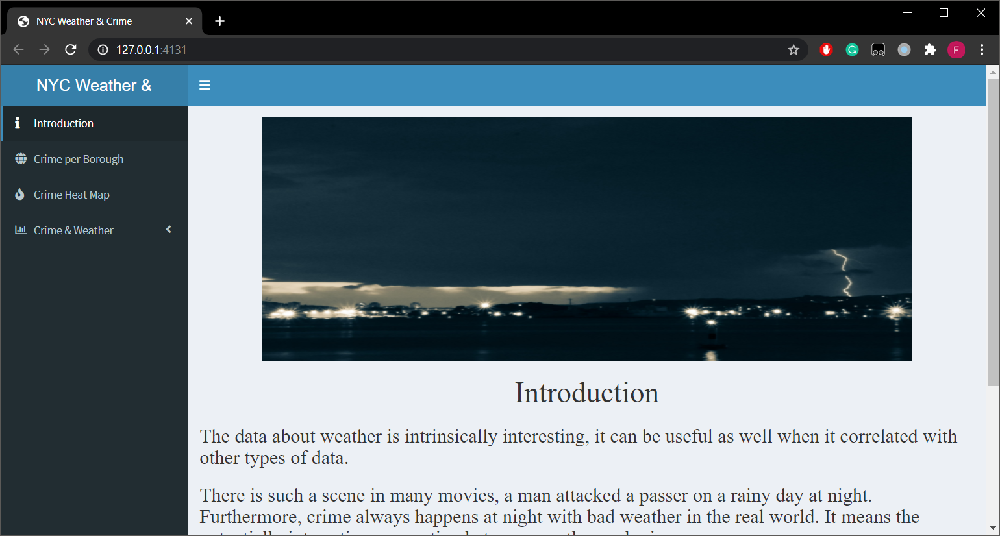

# Background

The data about weather is intrinsically interesting, it can be useful as well when it correlated with other types of data. There is such a scene in many
movies, a bad guy attacked an innocent citizen on a rainy day at night. Furthermore, crime always happens at night with bad weather in the real world. It
means the potentially interesting connection between weather and crime. 

The number of murders rose in 2019 to 318, the most since 2016, the New York Police Department said in its annual crime statistics report. New York has the
largest police department in America, it still has a high crime rate. As a chance to the general public and tourist of NYC and they can use this
visualisation project to raise awareness of prevention. Through the visualisation, they can know the criminal situation of each borough and the most common
types of crime in New York City. Meanwhile, the relationship between weather conditions and crime rate are pointed out to them.

# Component

This project required 3 parts:

1. two R files (vizShiny.R and readdata.R)

2. two datasets which in CSV files (weather.csv and crime.csv)

   crime.csv is too large and you need to dowload from:
   
   opt1: Google Drive: https://drive.google.com/file/d/1zx4Wz0pGNbm-wCf58oVzSg_NypPL_23G/view?usp=sharing
      
   opt2: Kaggle: will be available soon

3. A shape folder which is for geo map

# How to run

1. Download the code first into local file system

2. Download the crime.csv and move into the folder

3. Click and load the readdata.R and visShiny.R in Rstudio (Make sure R and Rstudio have been installed in your computer)

4. Run the readdata.R first to read these two datasets

5. Run the vizShiny.R to start the Shiny app

# Preview

Home page

NYC Crime Map

Weather Statistics

# Data Reference

a.	Historical hourly weather data – hourly weather data for 30 US & Canadian cities + 6 Israeli cities.

Tabular data: It has 7 datasets and only one of them can be used for my project, which are temperature.csv. This files recorded all temperatures and datetime
of every day’s hourly weather from 2012 - 2017. 

URL: https://www.kaggle.com/selfishgene/historical-hourly-weather-data#temperature.csv

b.	NYPD complaint Data Historic – all valid felony, misdemeanour, and violation crimes reported to the New York City Police Department. 

Tabular data: 6.85 million rows and 35 columns. Each row is a complaint which includes the date, time, location, plaint text which are detailed information
of the occurrence of the reported event and personal information of reporters. 

URL: https://data.cityofnewyork.us/Public-Safety/NYPD-Complaint-Data-Historic/qgea-i56i

Explore more by yourself! 

ENJOY!!!
